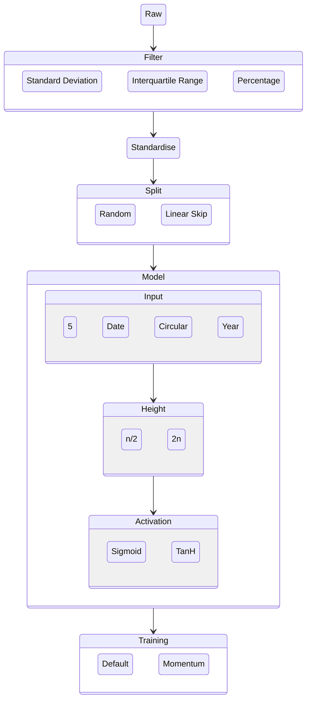

```mermaid
stateDiagram-v2
	direction TB

	Raw --> Filter
	Filter --> Standardise
	Standardise --> Split
	Split --> Model
	Model --> Training

	state Filter {
		direction TB
		std: Standard Deviation
		iqr: Interquartile Range
		per: Percentage
	}

	state Split {
		Random
		skip: Linear Skip
	}

	state Model {
		Input --> Height
		Height --> Activation

		state Input {
			5
			Date
			Circular
			Year
		}

		state Height {
			n/2
			2n
		}

		state Activation {
			Sigmoid
			TanH
		}
	}

	state Training {
		Default
		Momentum
	}
```
